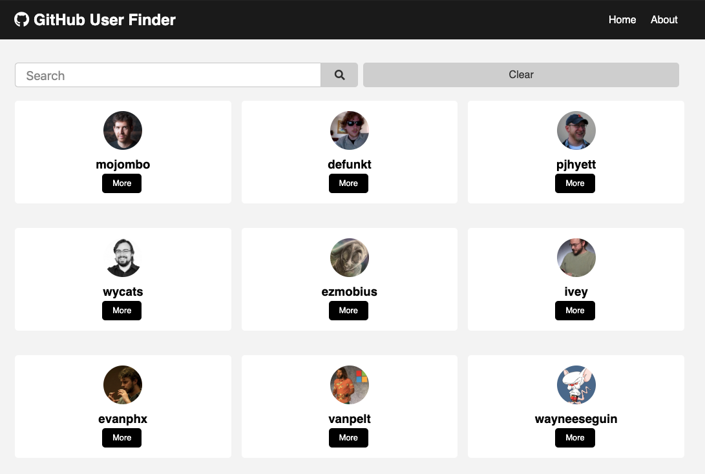

# :mag_right: GitHub User Finder :mag_right:

React App to search Github user profiles

## Screenshots

### 👥 Github User List



### 👤 Github User Details


## Usage

```bash
# Runs the app in the development mode.
# Opens http://localhost:3000
npm install
npm start
```

```bash
# Builds app for production to the build folder.
npm run build
```

## Reference

Inspired by [BradTraversy](https://github.com/bradtraversy/github-finder) github finder project
